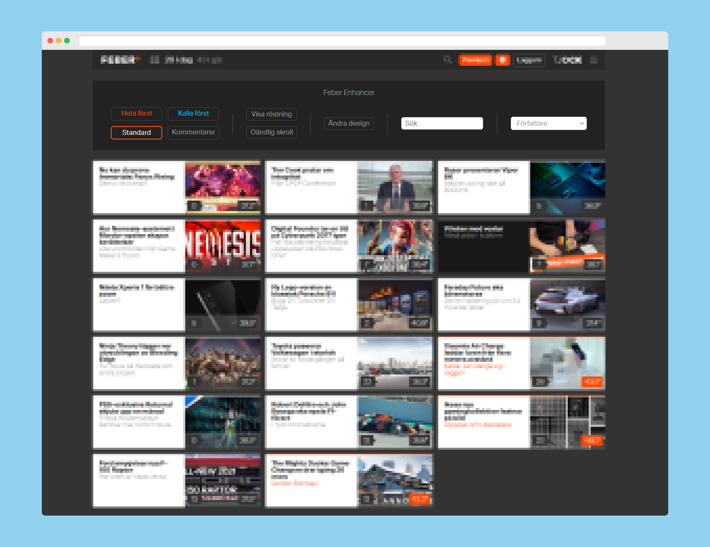

<p align="center">

  <a href="https://github.com/banjo/feber-enhancer">
    
  </a>

  <p align="center">
    Chrome tillägg med enkla tillägg och funktioner till Feber.
    <br />
  </p>
</p>

---



Feber Enhancer är ett Chrome extension för att underlätta surfandet på [Feber](https://www.feber.se). Små men enkla funkioner har lagts till, såsom sortering, filtrering, röstning och oändlig skroll. Samtliga i thumbnails-vyn. 

# Innehållsförteckning
- [Installera](#dart-installera)
- [Funktioner](#heavy_check_mark-funktioner)
- [Teknologier](#clipboard-teknologier)
- [Utveckla](#cloud-utveckla)
- [Bidra](#wrench-bidra)

___

# :dart: Installera
Appen är för tillfället inte uppladdad till Chrome Web Store, den kan istället laddas hem från [releases](https://github.com/banjo/feber-enhancer/releases/latest).

Installation sker enligt instruktionerna på [utveckla](#cloud-utveckla)-fliken.


# :heavy_check_mark: Funktioner

## Sortera


Man kan enkelt sortera de olika artiklarna uteefter vad man är ute efter. Just nu kan man sortera utefter:

* **Hetast**
* **Kallast**
* **Mest kommentarer**
* **Tid (standard)**

## Visa röstning


Du kan snabbt och enkelt lägga till möjligheten att rösta på artiklarna, utan att behöva gå in i artikeln.

## Oändlig skroll


Även om funktionen är högst experimentell, så tillåter den användaren att skrolla vidare utan att behöva byta sida för att få nya artiklar.

## Sök


Sök och filtrera artiklarna som du har laddat för att enkelt hitta något du själv är intresserad av.

## Filtrera författare


Filtrera efter dina favoritförfattare.

# :clipboard: Teknologier
* **Typescript**
* **jQuery**
* **Webpack**

# :cloud: Utveckla

```bash
# klona repo
$ git clone https://github.com/banjo/feber-enhancer.git

# byt till rätt map
$ cd "feber-enhancer"

# installera node-moduler
$ npm install

# starta lokalt
$ npm run watch

# bygg appen
$ npm run build
```

Filerna skapas till `dist`-mappen vid både watch och build. För att inkludera tillägget i Chrome:

* Öppna Chrome
* Gå till inställningarna för tillägg.
* Sätt på **Programmerarläge** högst upp till höger.
* Klicka på **Läser in okomprimerat tillägg**.
* Lägg till `dist`-mappen.


# :wrench: Bidra
Det är fritt fram att bidra, all hjälp uppskattas.
